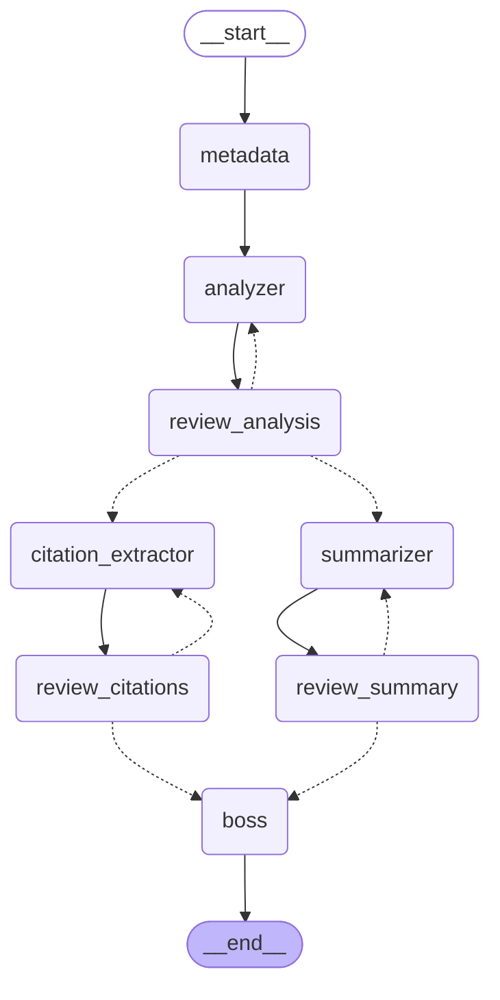

# Research Paper Analyzer

AI-powered multi-agent system that reads a research paper (PDF or text) and produces a
structured research brief: metadata, methodology/findings analysis, an executive summary,
and organized citations — each stage quality-checked and retried automatically before the
final brief is assembled.

Built for the Vilambo Private Limited AI Agent Developer Intern technical assignment.

## Architecture

Built with [LangGraph](https://github.com/langchain-ai/langgraph) as a state graph — not a
linear script. A **Boss Agent** (a deterministic combiner node, no LLM call needed for pure
assembly) orchestrates three specialized sub-agents, each gated by a shared, generic
**Review Agent** that scores outputs 1–10 and triggers retries below threshold.



*(Generated directly from the compiled graph via `graph.get_graph().draw_mermaid()` —
see `app/graph/build.py`'s `__main__` block to regenerate.)*

Solid arrows are fixed transitions; dashed arrows are the conditional
retry/proceed routing chosen at runtime based on review scores.

**Flow:**
1. `metadata` — one-shot extraction of title/authors/year/venue (not review-gated; low-stakes factual lookup)
2. `analyzer` → `review_analysis` — extracts methodology/hypothesis/experiments/findings, scored against the source paper; retries (max 2) if score < 7
3. Once analysis passes (or exhausts retries), it fans out in parallel to `summarizer` and `citation_extractor`, each with its own independent review/retry loop
4. Both branches converge on `boss`, which deterministically assembles the final markdown brief — no LLM call needed for pure combination
5. Any field that never passes review after its retry budget is flagged in the final brief rather than looping forever

### Agents

| Agent | File | Role |
|---|---|---|
| Boss (Orchestrator) | `app/agents/boss.py` | Deterministic combiner — assembles the final `ResearchBrief` from all approved outputs, no LLM call |
| Paper Analyzer | `app/agents/analyzer.py` | Extracts methodology, hypothesis, experiments, key findings |
| Summary Generator | `app/agents/summarizer.py` | 150–200 word executive summary (problem, approach, results) |
| Citation Extractor | `app/agents/citations.py` | All citations/references + flags key related work |
| Review Agent | `app/agents/reviewer.py` | **One** generic, reusable node parameterized by which field it's reviewing — not four separate review agents. Scores against the *source paper* (not just the output in isolation), returns `{score, feedback}`; threshold ≥7 passes, max 2 retries per field |
| Metadata | `app/agents/metadata.py` | One-shot title/authors/year/venue extraction (not review-gated) |

### State

`app/graph/state.py` — a `TypedDict` (`ResearchState`) with merge-reducers on the dicts/list
that the parallel summary and citation branches both write into (`review_scores`,
`review_feedback`, `retry_counts`, `flags`), since a plain overwrite reducer would let one
parallel branch's write clobber the other's.

## Setup

Requires Python 3.11+ (see [Known Limitations](#known-limitations) re: 3.14).

```bash
pip install -r requirements.txt
cp .env.example .env
# then edit .env and set GOOGLE_API_KEY (get one at https://aistudio.google.com/apikey)
```

`.env` model names are read per-node so they can be swapped without touching code — see
`.env.example` for current recommended values and why (some Gemini model generations have
been retired for new API keys; the file documents what's confirmed working).

## Usage

```bash
# .txt input
python -m app.main samples/input/attention_is_all_you_need.txt -o samples/output/attention_brief.md

# PDF input (uses docling for extraction)
python -m app.main samples/input/2607.18100v1.pdf -o samples/output/2607.18100v1_brief.md

# print to stdout instead of a file
python -m app.main samples/input/attention_is_all_you_need.txt
```

Logging is at INFO level on every node entry/exit, including review scores and retry
counts — this is the audit trail for how many iterations each field went through.

## Sample input/output

- Input: `samples/input/attention_is_all_you_need.txt` (small — cheap to test with)
- Input: `samples/input/2607.18100v1.pdf` (real arXiv PDF, exercises the docling path)
- Output: `samples/output/attention_brief.md`, `samples/output/2607.18100v1_brief.md`

## Known Limitations

- **Key Insights Agent not implemented.** The assignment marks this as an optional bonus
  agent (actionable takeaways / practical implications). Deferred to keep the required
  architecture (Boss + 3 sub-agents + Review) solid rather than half-covering a fourth.
  The state/schema design would extend cleanly to add it as a fourth parallel branch.
- **No UI.** Optional/bonus per the assignment; not built in this pass.
- **PDF extraction uses `docling`, not `marker-pdf`.** `marker-pdf` pins an older Pillow
  that fails to compile from source on Python 3.14; `docling` was swapped in and verified
  working end-to-end. It's heavier (pulls in layout/table/OCR models and downloads weights
  from Hugging Face on first run — ~1 minute for a typical paper, cached after).
- **Context handling is truncation, not chunking.** `MAX_CONTEXT_CHARS` (in `app/config.py`)
  caps how much of the paper text is sent per LLM call. Fine for typical papers; a very
  long paper could lose content past the cutoff rather than being summarized in chunks.
- **Gemini model availability shifts.** Several model generations (`gemini-2.0-*`,
  `gemini-2.5-*`) return 404 "no longer available to new users" on newly created API keys,
  even with billing enabled — this isn't a quota issue, the models are retired for new
  projects. `.env.example` documents which model names are confirmed working and how to
  check what's available on a given key.
- **No automated test suite yet** — `tests/` is scaffolded but empty. Validation so far has
  been manual end-to-end runs (small text sample + real PDF) plus a mocked-LLM run to
  verify the retry-cap/fan-out/fan-in logic in isolation.
